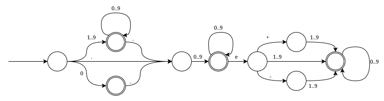

# Automate finite

Un automat finit este un cvintuplu $(Q, q_0, A, \Sigma, \delta)$, dupa cum urmeaza:
 - $Q=\{q_0, q_1, ..., q_n\}$ - multimea starilor;
 - $q_0$ - starea initiala;
 - $A \subseteq Q$ - multimea starilor finale;
 - $\Sigma$ - un alfabet;
 - $\delta : Q \times \Sigma \rightarrow Q$ - functia de tranzitie.

Aceasta definitie poate parea intimidanta, dar lucrurile sunt mai simple decat par. Vom vedea o reprezentare grafica pentru a intelege mai bine:



Fiecare cerc reprezinta o stare, iar sagetile tranzitiile. De exemplu, sageata cu "0" (dreapta-jos) face tranzitie de la prima stare (stanga) la alta stare. Starile cu contur dublu sunt stari finale. Sageata care intra in starea din stanga si nu iese din nicio alta stare este folosita pentru a identifica starea initiala.

In general, automatele finite sunt folosite pentru a verifica daca un sir de caractere respecta niste reguli. In cazul imaginii de mai sus, automatul verifica daca un sir de caractere este un numar floating point (am omis situatiile cand are "-" sau "+" in fata).

# Implementare

De obicei, singurul lucru care trebuie implementat este $\delta$ - functia de tranzitie, deoarece celelalte sunt destul de triviale: $Q$ de obicei este $\{ 0, 1, ..., n \}$, deci pastram doar variabila $n$, $q_0$ este un numar, $A$ este o submultime a multimii $\{ 0, 1, ..., n \}$, pentru reprezentarea careia avem mai multe variante (bitset, vector, set, unordered_set etc.), iar $\Sigma$ poate fi reprezentat prin $\{ 0, 1, ..., m \}$, unde $m$ este numarul de caractere.

Functia de tranzitie se poate implementa, de asemenea, in mai multe moduri:
 - o functie propriu-zisa care primeste ca parametru starea, respectiv caracterul de tranzitie si returneaza starea in care ajungem;
 - un vector bidimensional in care $aut[q][c]$ este starea in care se ajunge la tranzitia cu caracterul $c$ din starea $q$;
 - un unordered_map/map care asociaza unei perechi $(q, c)$ starea in care se ajunge la tranzitia cu caracterul $c$ din starea $q$;
 - etc.

Nu conteaza metoda de implementare in corectitudinea solutiei, important este sa stim, la orice moment, in ce stare ajungem la tranzitia (q, c). Vom vedea un exemplu concret de implementare la sectiunea urmatoare.

# String matching

Consideram urmatoarea problema: pentru un sir de caractere $s$ de lungime $n$ vrem sa gasim toate pozitiile unde acesta apare in alt sir $t$ de lungime $m$.

Exemplu:
$s=abac$

$t=abacabadabacaba$
|$t$|a|b|a|c|a|b|a|d|a|b|a|c|a|b|a|
|-|-|-|-|-|-|-|-|-|-|-|-|-|-|-|-|
|subsir?|1|0|0|0|0|0|0|0|1|0|0|0|0|0|0|

Algoritmul trivial verifica pentru fiecare pozitie din sirul $t$ daca sirul $s$ este subsir ce incepe pe pozitia respectiva, si are complexitate $O(n(m-n))$:
```cpp
vector<bool> matching(string s, string t)
{
    int n = s.size();
    int m = t.size();

    vector<bool> ans(m);
    for (int i = 0; i < m - n; i++) {
        ans[i] = 1;
        for (int j = 0; j < n; j++) {
            if (s[j] != t[i]) {
                ans[i] = 0;
            }
        }
    }

    return ans;
}
```

In general, $m$ este mult mai mare decat $n$, caz in care, algoritmul de mai sus e prea incet (obs.: daca m este putin mai mare decat n, atunci pana si algoritmul trivial ruleaza relativ rapid).

In continuare, vom construi pas cu pas o solutie cu complexitate de timp cat mai mica.

Primul pas este de a construi un automat ce recunoaste sirul $s$. Astfel, cautarea aparitiilor sirului $s$ in $t$ se va face prin trecerea sirului $t$ prin automat si verificarea daca starea curenta este finala sau nu, deci vom avea o complexitate de timp de $O(T(n) + m)$, unde $T(n)$ este complexitatea construirii automatului, deci nu mai putem avea factori de genul $nm$ sau $nlogm$ etc.

Acum, vom vedea cum construim automatul. Vom considera cate o stare pentru fiecare prefix al lui $s$, numerotate de la $0$ la $n$ (starea $0$ inseamna un sir gol, starea $1$ inseamna un sir egal cu $s[0...1)$, starea $2$ un sir egal cu $s[0...2)$ etc.). Unele tranzitii sunt evidente: de la $i$ la $i+1$ se face tranzitia cu caracterul $s[i]$. In total, vom avea complexitate de $O(n)$ pentru acestea.

Pentru restul tranzitiilor este mai complicat. Pentru fiecare $s[0...i] + c$, unde $c$ este un caracter diferit de $s[i]$, trebuie sa gasim cel mai lung al lui $s$ ce este identic cu un sufix al lui $s[0...i] + c$. Acest lucru se face trivial in $O(n^2)$ pentru fiecare pereche $(i, c)$, deci in total complexitatea va fi de $O(n^3|\Sigma|)$.

In continuare, vom prezenta niste metode ce vor fi folosite pentru a reduce complexitatea de timp a constructiei automatului.

# Functia prefix

Pentru un sir de caractere $s$ de lungime $n$, functia prefix (notata cu $\pi(i)$) este definita astfel:
$\pi(i)=$ lungimea celui mai lung prefix propriu al subsirului $s[0...i]$ care este si sufix.

Exemplu:
|$s$|a|b|a|c|a|b|a|d|a|b|a|c|a|b|a|
|-|-|-|-|-|-|-|-|-|-|-|-|-|-|-|-|
|$\pi(i)$|0|0|1|0|1|2|3|0|1|2|3|4|5|6|7|

Valorile functiei se pot calcula trivial in $O(n^2)$ astfel:
```cpp
vector<int> prefix(string s)
{
    int n = s.size();
    vector<int> pi(n);
    
    pi[0] = 0;
    for (int i = 1; i < n; i++) {
        for (int j = 0; i + j < n && s[i + j] == s[j]; j++) {
            pi[i + j] = max(pi[i + j], j);
        }
    }

    return pi;
}
```

Totusi, putem obtine complexitate de timp de $O(n)$ folosind urmatoarele observatii:
 - un prefix care este si sufix al subsirului $s[0...i]$ este format dintr-un prefix care este si sufix al subsirului $s[0...i-1]$ la care mai adaugam o litera
 - daca $\pi(i)$ este lungimea celui mai lung prefix care este si sufix al subsirului $s[0...i]$, urmatorul cel mai mare prefix care este si sufix este $\pi(\pi(i)-1)$

Astfel, ne putem folosi de valorile functiei $\pi$ calculate anterior pentru a obtine $\pi(i)$:
```cpp
vector<int> prefix(string s)
{
    int n = s.size();
    vector<int> pi(n);
    
    int j = 0;
    pi[0] = 0;
    for (int i = 1; i < n; i++) {
        while (j > 0 && s[j] != s[i]) {
            j = pi[j - 1];
        }

        if (s[j] == s[i]) {
            j++;
        }

        pi[i] = j;
    }

    return pi;
}
```

La prima vedere, algoritmul nu pare sa aibe complexitate de timp de $O(n)$ din cauza buclei de pe linia $9$, dar defapt aceasta nu va face mai mult de $n-1$ pasi (in total):
 - $j$ porneste de la $0$, iar la fiecare iteratie a "for"-ului va fi incrementat maxim o singura data, pentru un total de $n-1$ incrementari;
 - fiecare iteratie a "while"-ului decrementeaza $j$ cu cel putin $1$;
 - indiferent de ordinea incrementarilor/decrementarilor, deoarece $j$ ramane mereu $>= 0$, nu pot fi efectuate mai multe decrementari decat incrementari, deci "while"-ul ruleaza de cel mult $n-1$ ori.

# Knuth-Morris-Pratt

Algoritmul KMP este folosit pentru a gasi locurile in care un sir $s$ (numit pattern) de lungime $n$, apare ca subsir in alt sir $t$ de lungime $m$.

Acum ca putem calcula functia prefix in $O(n+m)$, este destul de evident cum putem face acest lucru. Avem 2 abordari:
 - construim functia prefix pentru sirul $s + '#' + t$, unde '#' este orice caracter ce nu apare in $s$. Raspunsul va fi fiecare pozitie in care functia prefix are valoarea egala cu lungimea lui $s$. Metoda are complexitatea de timp de $O(n+m)$ si consuma mai multa memorie decat metoda ce urmeaza, deoarece mentine in memorie si sirul $t$, cat si valorile functiei prefix pentru acesta.
 - construim functia prefix doar pentru sirul $s$, apoi rulam pentru sirul $t$ algoritmul de constructie al functiei prefix, fara a mai atribui lui $\pi(i)$ valoarea lui $j$. Se observa ca niciodata valorile functiei prefix nu vor fi mai mari decat lungimea sirului $s$, deci nu e nevoie sa le pastram in memorie pana la final.

# Construirea automatului

In sfarsit, vom reveni la construirea automatului. Pentru fiecare tranzitie de intoarcere, ne putem folosi de functia $\pi$ pentru a afla rapid starea in care trebuie sa ne intoarcem. Astfel, am redus complexitatea la $O(n|\Sigma|)$.

Observatie: complexitatea pentru KMP este de $O(n + m)$, in timp ce pentru automat este $O(n|\Sigma| + m)$, ceea ce inseamna ca KMP este mai eficient, dar exista o diferenta destul de importanta: termenul de $m$ din KMP este amortizat. Asta inseamna ca, desi complexitatea totala este de $O(n + m)$, complexitatea pentru o singura litera poate ajunge la $O(n + m)$. In cazul unor probleme, cu unele modificari asupra algoritmului, duc la o complexitate totala mult prea mare (ex.: [Prefix Function Queries - Codeforces](https://codeforces.com/problemset/problem/1721/E)).

# Probleme
 - [strmatch - infoarena](https://www.infoarena.ro/problema/strmatch) - exemplu
 - [MUH and Cube Walls - Codeforces](https://codeforces.com/problemset/problem/471/D)
 - [Preffixes and Suffixes - Codeforces](https://codeforces.com/contest/432/problem/D)

# Resurse

 - [Prefix function. Knuth-Morris-Pratt](https://cp-algorithms.com/string/prefix-function.html)
 - [Automate finite si KMP - infoarena](https://www.infoarena.ro/automate-finite-si-kmp)
 - [Suffix Automaton](https://cp-algorithms.com/string/suffix-automaton.html) - automate ce recunosc sufixele unui sir de caractere

