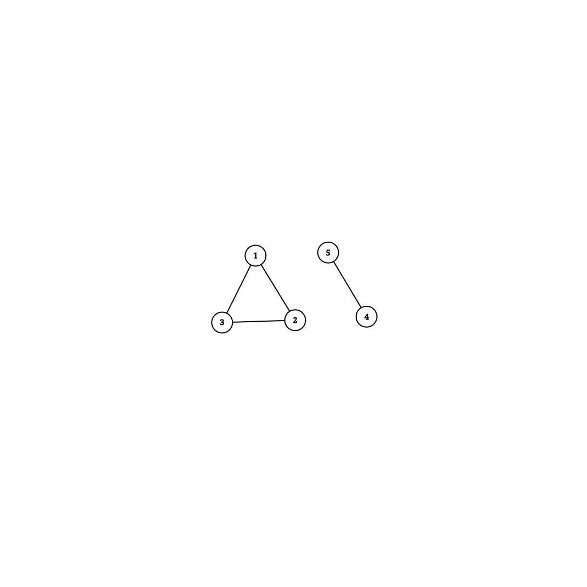
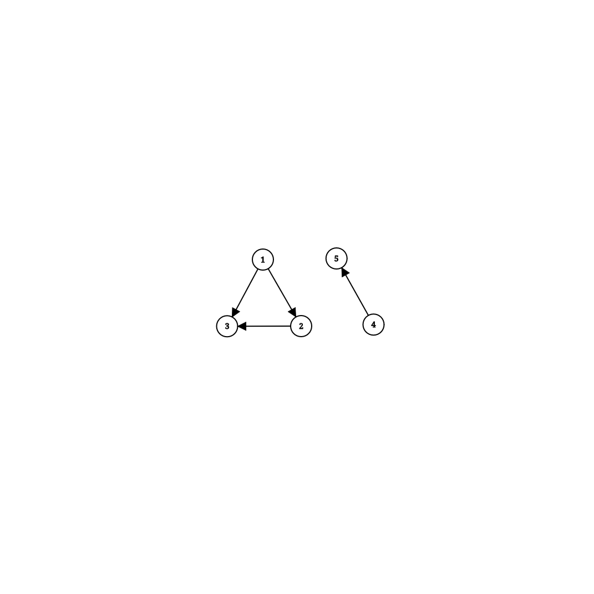

# Ce este un graf?

Un graf $G$ este o pereche $(V, E)$, unde $V$ este o multime numita multimea de noduri, iar $E$ este o multime de perechi $(u, v) \in E$, unde $u, v \in V$, numita multimea de muchii.
Acesta se poate reprezenta geometric prin puncte (noduri), conectate intre ele prin linii (muchii).

In functie de ordonarea perechilor $(u, v) \in E$, grafurile pot fi de doua tipuri:
 - orientate, daca perechile $(u, v) \in E$ sunt ordonate
 - neorientate, daca perechile $(u, v) \in E$ sunt neordonate

O observatie importanta este ca un graf neorientat $G=(V, E)$ este echivalent cu un graf orientat $G'=(V, E')$, unde $E'=\{(u, v), (v, u) \vert (u, v) \in E\}$. Astfel, orice algoritm care poate fi implementat pe grafuri orientate, poate fi implementat si pe grafuri neorientate.

## Exemplu
Daca $V=\{1, 2, 3, 4, 5\}$, iar $E=\{(1, 2), (3, 2), (5, 4), (1, 3)\}$, graful neorientat $G=(V,E)$ se poate reprezenta astfel:


Daca $V=\{1, 2, 3, 4, 5\}$, iar $E=\{(1, 2), (2, 3), (1, 3), (4, 5)\}$, graful orientat $G=(V,E)$ se poate reprezenta astfel:


## Definitii

Pentru inceput, vom folosi niste notatii:
 - literele mici $u, v, w$ se vor referi la noduri
 - literele mari $U, V, W$ se vor referi la multimi/submultimi de noduri
 - litera mica $e$ se va referi la o muchie
 - litera mare $E$ se va referi la o multime/submultie de muchii
 - litera mica/mare $n/N$ se va referi la numarul de noduri dintr-un graf
 - litera mica/mare $m/M$ se va referi la numarul de muchii dintr-un graf

Pornind de la notiunea de graf, vom defini niste termeni ce vor fi utili mai tarziu:
 - lant - un sir de noduri $u_i$, $i \in \overline{1,k}$, cu conditia ca $(u_i, u_{i+1}) \in E$, $\forall i \in \overline{1, k-1}$
 - lant simplu - un lant ce nu contine aceeasi muchie de 2 sau mai multe ori
 - lant elementar - un lant ce nu contine acelasi nod de 2 sau mai multe ori
 - ciclu - un lant simplu pentru care $u_1 = u_k$, adica incepe si se termina in acelasi nod
 - ciclu elementar - un ciclu pentru care $u_1, ..., u_{k-1}$ este lant elementar (adica se respecta conditia lantului elementar, mai putin pentru $u_1$ si $u_k$)

# Reprezentarea grafurilor in memorie

Exista trei metode principale de reprezentare a grafurilor, fiecare utila in diverse aplicatii:
 1. Matrice de adiacenta - o matrice $N \times N$, unde $A[u][v] = 1$ daca $(u, v) \in E$, $0$ altfel
 2. Liste de adiacenta - pentru fiecare nod $u$ retinem o lista cu nodurile $v$ pentru care exista muchia $(u, v) \in E$
 3. Lista de muchii - retinem o lista formata din perechile $(u, v) \in E$

## Matrice de adiacenta

```cpp
#define NMAX 500

int n, a[NMAX][NMAX];

void add_edge(int u, int v)
{
  a[u][v] = 1;
}

void remove_edge(int u, int v)
{
  a[u][v] = 0;
}

bool find_edge(int u, int v)
{
  return a[u][v];
}

void iterate_neighbours(int u)
{
  for (int v = 0; v < n; v++) {
    if (a[u][v]) {
      // v is a neighbour of u
    }
  }
}
```

## Liste de adiacenta

```cpp
#define NMAX 100000

int n;
std::vector<int> g[NMAX];

void add_edge(int u, int v)
{
  g[u].push_back(v);
}

void remove_edge(int u, int v)
{
  int i = 0;
  while (g[u][i] != v) {
    i++;
  }

  g[u].erase(g[u].begin() + i);
}

bool find_edge(int u, int v)
{
  int i = 0;
  while (i < g[u].size() && g[u][i] != v) {
    i++;
  }

  return i < g[u].size();
}

void iterate_neighbours(int u)
{
  for (int v : g[u]) {
    // v is a neighbour of u
  }
}
```

## Liste de muchii

```cpp
#define MMAX 200000

int m;
std::vector<std::pair<int, int>> e;

void add_edge(int u, int v)
{
  e.emplace_back(u, v);
}

void remove_edge(int u, int v)
{
  int i = 0;
  while (e[i].first != u || e[i].second != v) {
    i++;
  }

  e.erase(e.begin() + i);
}

void find_edge(int u, int v)
{
  int i = 0;
  while (i < m && (e[i].first != u || e[i].second != v)) {
    i++;
  }

  return i < e.size();
}

void iterate_neighbours(int u)
{
  for (int i = 0; i < m; i++) {
    if (e[i].first == u) {
      int v = e[i].second;
      // v is a neighbour of u
    }
  }
}
```

In diverse situatii, poate fi benefica folosirea unei structuri std:;set in loc de std::vector, deoarece ne permite sa stergem/cautam muchii in timp logaritmic. Totusi, daca nu avem nevoie de astfel de operatii, sau daca sunt foarte putine, Adaguarea si iterarea sunt mult mai rapide cu std::vector. Structura de date folosita trebuie aleasa in functie de ideea de rezolvare a problemei.

## Comparatie din punct de vedere al eficientei timp/spatiu

Pentru a putea alege metoda de reprezentare, este important sa stim care sunt avantajele si dezavantajele fiecarei metode. In primul rand, matricea de adiacenta are complexitate de spatiu de $O(N^2)$, in timp ce listele de adiacenta au complexitate $O(N + M)$, iar lista de muchii $O(M)$. Deci, daca numarul de muchii este mic ($~N$, graful este rar), matricele de adiacenta irosesc foarte multa memorie, in comparatie cu celelalte metode, de multe ori fiind imposibila reprezentarea prin matrice de adiacenta, in limitele de memorie.

In schimb, daca $M ~ N^2$ (graful este dens), matricea de adiacenta prezinta multe avantaje:
|Metoda|Adaugare muchie|Stergere muchie|Cautare muchie|Parcurgere vecini|
|-|-|-|-|-|
|Matrice de adiacenta|$O(1)$|$O(1)$|$O(1)$|$O(N)$|
|Liste de adiacenta|$O(1)$|$O(S_u)^*$|$O(S_u)^*$|$O(S_u)$|
|Lista de muchii|$O(1)$|$O(M)^*$|$O(M)^*$|$O(M)^{**}$|

$^*$ se pot reduce de la $O(K)$ la $O(\log{K})$ daca in loc de liste folosim un arbore binar de cautare (std::set)

$^**$ se poate reduce la $O(S_u + \log{M})$ prin aceeasi modificare ca mai sus

# Parcurgeri

## BFS (Breath-First Search)

```cpp
int n;
vector<int> g[NMAX];
bool visited[NMAX];

void bfs(int s) {
  queue<int> q;

  q.push(s);
  visited[s] = true;

  while (!q.empty()) {
    int u = q.front();
    q.pop();

    for (auto v : g[u]) {
      if (!visited[v]) {
        q.push(v);
        visited[v] = true;
      }
    }
  }
}
```

### Determinarea componentelor conexe

Intr-un graf neorientat, o componenta conexa este o submultime de noduri $U$ pentru care $\forall u, v \in U$, exista un lant de la $u$ la $v$.

Observatia 1: Daca $U$ si $V$ sunt doua componente conexe diferite, acestea sunt disjuncte d.p.d.v. al nodurilor si al muchiilor.

Consecinta: Un graf neorientat se poate partitiona in componente conexe disjuncte d.p.d.v. al nodurilor si al muchiilor.

Observatia 2: Pentru orice nod $u$, componenta conexa in care se afla $u$ este multimea tuturor nodurilor $v$ pentru care exista un lant de la $u$ la $v$.

Astfel, pentru a gasi componentele conexe dintr-un graf, putem porni cate un BFS pentru fiecare nod a carui componenta conexa nu a fost inca gasita. Deoarece fiecare BFS are complexitate $O(N_i + M_i)$, unde $N_i$ si $M_i$ sunt numarul de noduri, respectiv de muchii, din componenta conexa $i$ si $\sum{N_i}=N$, respectiv $\sum{M_i}=M$, complexitatea totala este de $O(N + M)$.

```cpp
int n, c[NMAX];
vector<int> g[NMAX];

void bfs(int s, int i) {
  queue<int> q;

  q.push(s);
  c[s] = i;

  while (!q.empty()) {
    int u = q.front();
    q.pop();

    for (auto v : g[u]) {
      if (c[v] == 0) {
        q.push(v);
        c[v] = i;
      }
    }
  }
}

void find_conex()
{
  int i = 1;
  for (int u = 0; u < n; u++) {
    if (c[u] == 0) {
      bfs(u, i++);
    }
  }
}
```

## DFS (Depth-First Search)

```cpp
int n;
vector<int> g[NMAX];
bool visited[NMAX];

void dfs(int u) {
  // Vizitam nodul u
  visited[u] = true;

  for (auto v : g[u]) {
    if (!visited[v]) {
      dfs(v);
    }
  }
}
```

Observatie: Determinarea componentelor conexe intr-un graf neorientat este posibila si cu DFS. Care este avantajul BFS-ului?

### Determinarea componentelor tare conexe

Intr-un graf orientat, o componenta tare conexa este o submultime de noduri $U$ pentru care $\forall u, v \in U$, exista un lant de la $u$ la $v$.

Observatia 1: Daca $U$ si $V$ sunt doua componente conexe diferite, acestea sunt disjuncte d.p.d.v. al muchiilor. Fata de componentele conexe de la grafuri neorientate, nu mai putem spune ca sunt disjuncte d.p.d.v. al nodurilor. De ce?

Consecinta: Un graf orientat se poate partitiona in componente conexe disjuncte d.p.d.v. al muchiilor.

Observatia 2: Pentru orice nod $u$, componenta conexa in care se afla $u$ este multimea tuturor nodurilor $v$ pentru care exista un lant de la $u$ la $v$.

#### Algoritmul Kosaraju-Sharir

TODO

#### Algoritmul lui Tarjan

TODO

## Probleme
 - [conexidad](https://kilonova.ro/problems/20) (OJI 2019)
 - [nestemate](https://kilonova.ro/problems/2508) (OJI 2024)
 - [patrol](https://kilonova.ro/problems/302) (IIOT 2022-2023 Runda 1)

# Grafuri cu costuri

Un graf cu costuri este un graf $G=(V, E)$, unde multimea de muchii $E$ este formata din $(u, v, w) \in E$, unde $u$ si $v$ au aceeasi semnificatie ca la grafurile obisnuite, iar $w$ se numeste costul muchiei. Putem asemana acest cost cu distanta intre doua puncte din spatiu, costul de a merge dintr-un oras in altul etc.

Reprezentarea acestora este identica cu cea la grafuri obisnuite, cu urmatoarele modificari:
 - matricea de adiacenta contine in $A[u][v]$ costul muchiei $(u, v)$ daca aceasta exista, $0$ altfel
 - listele de adiacenta contin, in afara de nodul vecin, costul muchiei de la $u$ la $v$
 - lista de muchii, pe pozitia $i$, contine si costul muchiei $(u_i, v_i)$

## Algoritmul lui Dijkstra

```cpp
int n, d[NMAX];
vector<pair<int, int>> g[NMAX];

void dijkstra(int s)
{
  for (int u = 0; u < n; u++) {
    d[u] = INF;
  }

  set<pair<int, int>> q;
  
  q.emplace(0, s);
  d[s] = 0;

  while (!q.empty()) {
    int u = q.begin()->second;
    q.erase(q.begin());

    for (auto[v, w] : g[u]) {
      if (d[u] + w < d[v]) {
        q.erase({ d[v], v });
        d[v] = d[u] + w;
        q.emplace(d[v], v);
      }
    }
  }
}
```

## Algoritmul Bellman-Ford

```cpp
int n, d[NMAX];
vector<pair<int, int>> g[NMAX];

void bellman_ford(int s)
{
  for (int u = 0; u < n; u++) {
    d[u] = INF;
  }

  d[s] = 0;

  bool changed;
  do {
    changed = false;
    
    for (int u = 0; u < n; u++) {
      for (auto[v, w] : g[u]) {
        if (d[u] + w < d[v]) {
          d[v] = d[u] + w;
          changed = true;
        }
      }
    }
  } while (changed);
}
```

```cpp
int n, m, d[NMAX], u[NMAX], v[NMAX], w[NMAX];

void bellman_ford(int s)
{
  for (int u = 0; u < n; u++) {
    d[u] = INF;
  }

  d[s] = 0;

  bool changed;
  do {
    changed  = false;

    for (int i = 0; i < m; i++) {
      if (d[u[i]] + w[i] < d[v[i]]) {
        d[v[i]] = d[u[i]] + w[i];
        changed = true;
      }
    }
  } while (changed);
}
```

## Probleme
 - [ateleport](https://kilonova.ro/problems/17) (OJI 2020)

# Arbori

Un arbore este un graf conex cu $N - 1$ muchii. Nodurile cu un singur vecin se numesc frunze.

Un arbore poate avea un nod numit radacina, caz in care se numeste arbore inradacinat. In acest caz, arborele este orientat, si putem defini pentru fiecare nod un parinte.

## Reprezentare

Arborii se pot reprezenta la fel ca orice graf, dar daca arborele este inradacinat, exista o reprezentare mai buna in cazul unor probleme, si anume prin vector de parinti: in loc sa retinem muchiile, retinem pentru fiecare nod care este parintele sau. Prin conventie, putem alege ca radacina sa aiba o valoare speciala ce nu reprezinta niciun nod, sau chiar pe ea insasi.

```cpp
int n, t[NMAX];

void to_root(int u)
{
  while (t[u] != u) {
    u = t[u];
  }
}
```

## Paduri de multimi disjuncte

O padure este o multime de arbori. O padure de multimi disjuncte este o padure pentru care nu ne intereseaza topologia fiecarui arbore, ci doar ce noduri contine. Operatiile ce sunt in general efectuate pe acestea sunt:
 - $root(u)$ - care este radacina arborelui in care se afla $u$
 - $merge(u, v)$ - imbina arborii in care se afla $u$, respectiv $v$

Vom vedea cum putem implementa aceste operatii, pornind de la metoda "brute force", pana la metoda optima.

Deoarece lucram cu arbori, putem sa-i reprezentam printr-un vector de parinti. Initial, fiecare nod e intr-un arbore propriu, deci vom initializa parintii nodurilor cu ele insasi.

La o operatie de cautare radacina, putem urca in sus in arbore pana gasim radacina. O operatie de imbinare consta modifica parintele radacinii unuia dintre arbori in radacina celuilalt.

```cpp
int n, parent[NMAX];

void init()
{
  for (int i = 0; i < n; i++) {
    parent[i] = i;
  }
}

int get_root(int u)
{
  if (parent[u] == u) {
    return u;
  }

  return get_root(parent[u]);
}

void merge(int u, int v)
{
  u = get_root(u);
  v = get_root(v);

  parent[v] = u;
}
```

Complexitatea de timp, in cel mai rau caz, al fiecarei operatii este de $O(N)$, deoarece putem ajunge sa avem un lant de $N$ noduri de la $u$ la radacina.

O optimizare foarte simpla este ca atunci cand cautam radacina unui arbore, sa modificam parintii nodurilor de pe acest lant in radacina. Putem face acesta, deoarece nu ne intereseaza topologia arborelui, ci doar nodurile continute.

```cpp
int get_root(int u)
{
  if (parent[u] == u) {
    return u;
  }

  return parent[u] = get_root(parent[u]);
}
```

Desi pare banala, aceasta reduce complexitatea ambelor operatii la $O(\log{N})$. In majoritatea situatiilor, aceasta optimizare este suficienta, dar putem obtine o complexitate si mai buna.

In loc de a imbina un nod oarecare la celalalt, putem folosi o euristica pentru a alege un nod ce duce la lanturi cat mai mici. Metodele principale sunt uniune prin rang sau prin marime.

Uniunea prin marime imbina arborele mai mic in arborele mai mare. Trebuie, deci, sa mentinem si marimea fiecarui arbore pe parcurs.

```cpp
int n, parent[NMAX], size[NMAX];

void init()
{
  for (int i = 0; i < n; i++) {
    parent[i] = i;
    size[i] = 1;
  }
}

void merge(int u, int v)
{
  u = get_root(u);
  v = get_root(v);

  if (u == v) {
    return;
  }

  if (size[u] < size[v]) {
    swap(u, v);
  }

  parent[v] = u;
  size[u] += size[v];
}
```

Acest lucru reduce complexitatea de timp la $O(\alpha(N))$, unde $\alpha(N)$ este functia inversa Ackermann. Aceasta creste atat de incet, incat pentru $N < 10^600$, avem ca $\alpha(N) \leq 4$.

## Arbori partiali de cost minim

Pentru un graf conex $G=(V,E)$, un arbore partial este un subgraf conex $G'=(V,E')$, unde $|E'| = |V| - 1$.

Un arbore partial de cost minim al unui graf ponderat este un arbore partial pentru care suma costurilor muchiilor este minima.

### Algoritmul lui Kruskal

Algoritmul lui Kruskal este folosit pentru a gasi un arbore partial de cost minim. Acesta functioneaza in felul urmator:
 - initial, multimea muchiilor din arbore este vida
 - parcurgem muchiile grafului in ordine crescatoare a costului
   - daca muchia curenta uneste doua componente disjuncte, le imbinam si adaugam muchia la arbore
   - altfel, trecem la muchia urmatoare

```cpp
struct edge
{
  int u, v, w;
};

int m;
edge e[MMAX];

int n, parent[NMAX], size[NMAX];

void init()
{
  for (int i = 0; i < n; i++) {
    parent[i] = i;
    size[i] = 1;
  }
}

int get_root(int u)
{
  if (parent[u] == u) {
    return u;
  }

  return parent[u] = get_root(parent[u]);
}

bool merge(int u, int v)
{
  int u = get_root(u);
  int v = get_root(v);

  if (u == v) {
    return false;
  }

  if (size[u] < size[v]) {
    swap(u, v);
  }

  parent[v] = u;
  size[u] += size[v];
  return true;
}

int kruskal()
{
  sort(e, e + m, [](const edge& e1, const edge& e2) {
    return e1.w < e2.w;
  });

  int w = 0;
  for (int i = 0; i < m; i++) {
    if (merge(e[i].u, e[i].v)) {
      w += e[i].w;
    }
  }

  return w;
}
```

### Algoritmul lui Prim

TODO

## Programare dinamica pe arbori

TODO

## Probleme
 - [ninjago](https://kilonova.ro/problems/27) (OJI 2017)
 - [arbsumpow](https://kilonova.ro/problems/67) (ONI 2021, Baraj Seniori)

